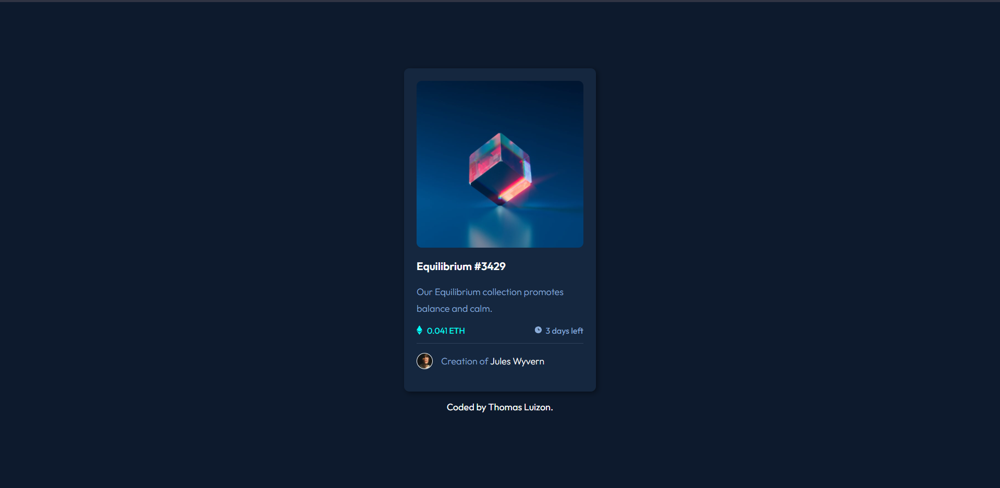

# Frontend Mentor - NFT preview card component solution

This is a solution to the [NFT preview card component challenge on Frontend Mentor](https://www.frontendmentor.io/challenges/nft-preview-card-component-SbdUL_w0U).

## Table of contents

  - [Links](#links)
  - [Built with](#built-with)
  - [What I learned](#what-i-learned)
  - [Author](#author)

### Links

- Solution URL: (https://www.frontendmentor.io/solutions/ntfcard-htmlcss-WyoeXYSyi)
- Live Site URL: (https://thomasluizon.github.io/NFT-preview-card/)

### Built with

- Semantic HTML5 markup
- CSS custom properties
- Flexbox

### What I learned

Doing this project i realized that a lot of things that i thought i knew, i didn't really knew, so it was really good for my personal development skills, also the hover part was really mindblowing.

## Author

- Linkedin - [Thomas Luizon](https://www.linkedin.com/in/thomas-luizon/)
- Frontend Mentor - [@ThomasLuizon](https://www.frontendmentor.io/profile/ThomasLuizon)